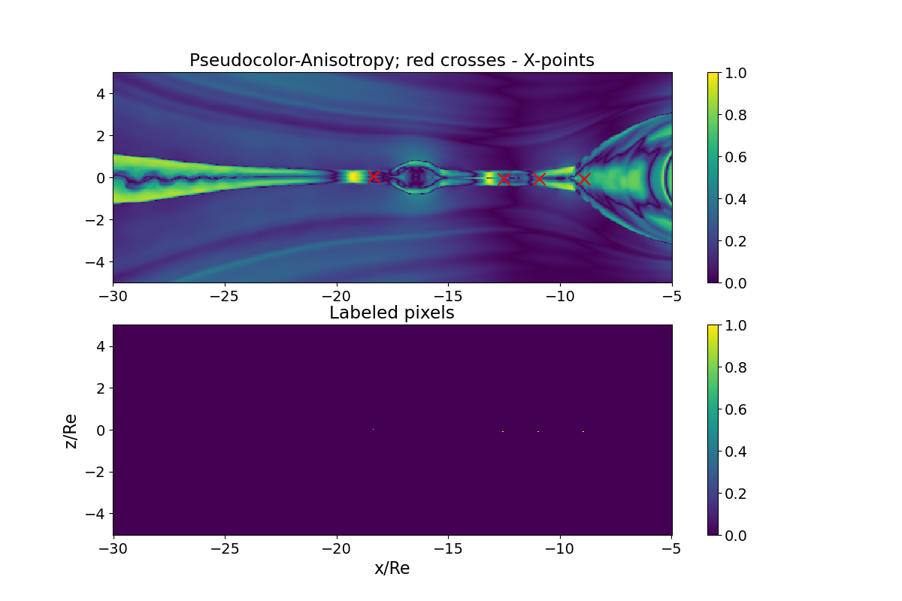
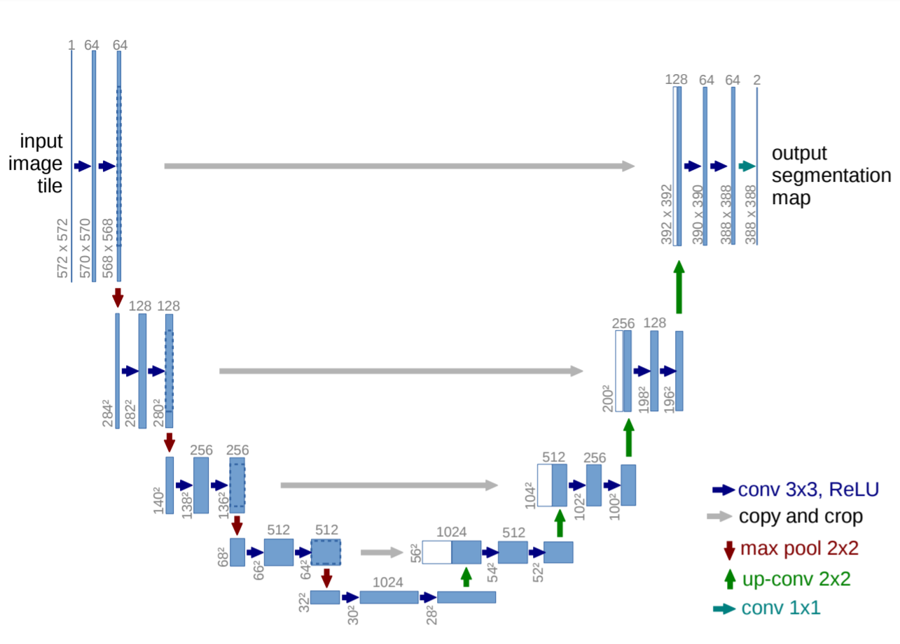

# unet-reconnection

Magnetic reconnection identification using image segmentation with U-Net

## Outline



## Environment

Build the Docker image

```bash
docker build . -t unet-reconnection
```

Start a container interactively with current directory mounted

```bash
./run_docker.sh
```

Re-enter stopped container

```bash
docker start -i <container id>
```

## Slurm

```
. ./env.sh
```

```
sinteractive --account project_2004522 --cores 1 --time 01:00:00 --mem 4G --tmp 100
```

```
bash steer.sh -t train -d sample
bash steer.sh -t plot -d sample
```

## Train

```
train.py -i sample/data --epochs 5 --normalize --data-splits 0.6 0.2 0.2 -o sample/results
```

## Plot

```
plot.py -d sample/results
```

## Model

Ref. [U-Net: Convolutional Networks for Biomedical Image Segmentation](https://arxiv.org/abs/1505.04597)

