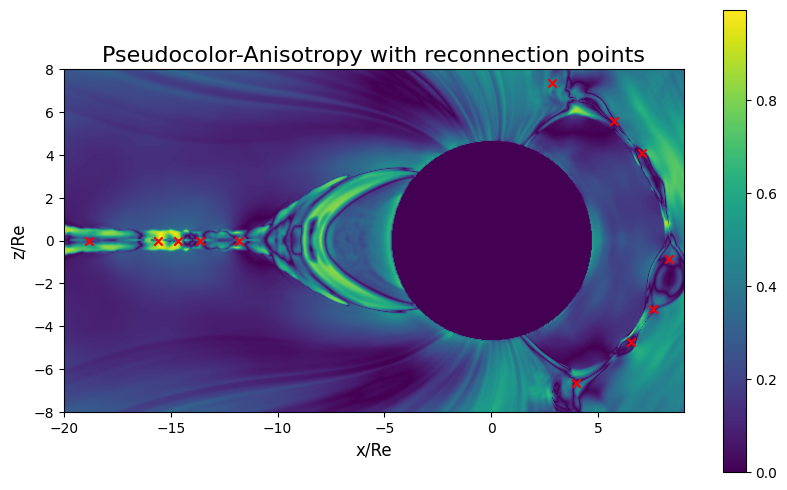

# unet-reconnection

Magnetic reconnection identification using image segmentation with U-Net

## Outline



## Environment

Build the Docker image

```bash
docker build . -t unet-reconnection
```

Start a container interactively with current directory mounted

```bash
./run_docker.sh
```

Re-enter stopped container

```bash
docker start -i <container id>
```

Or without Docker
```
. ./env.sh
pip install -r requirements.txt
```

## Train

```
train.py -i sample/data --epochs 5 --normalize --data-splits 0.6 0.2 0.2 -o sample/results
```

## Plot

```
plot.py -d sample/results
```

## Predict

This command will use the trained model in `results/raw-standardized-1` and do the predictions for all files in the `3d-data` folder. The output is written to `3d-results`. It takes care of all the proper configuration (normalization etc.) by using the `metadata.json` file in the model directory.
```
predict.py -m results/raw-standardized-1 -i 3d-data -o 3d-results
```

## Slurm

Add executables to path
```
. ./env.sh
```

To train all models (note that task can be train or plot, and project refers to CSC project id)
```
./steer.sh -t <TASK> -d <DIR> -p <PROJECT>
```

Compare loss and number of epochs between all runs
```
analyze_runs.py
```

## Model

Ref. [U-Net: Convolutional Networks for Biomedical Image Segmentation](https://arxiv.org/abs/1505.04597)


